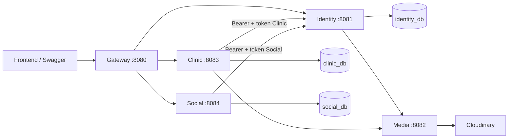

# Ranh giới microservices

## Quyền sở hữu dữ liệu

| Chủ sở hữu | Bảng | Giao tiếp ra ngoài |
| --- | --- | --- |
| Identity | users, invalidated_token | Redis cho OTP/rate limit, Brevo, Media |
| Clinic | clinics, services, appointments, appointment_services, clinic_activation_outbox | Identity HTTP, Media HTTP, Gemini, bản đồ, Firebase |
| Social | friendships, pet_lockets | Identity HTTP |
| Media | Không có bảng SQL | Cloudinary |
| Gateway | Không có bảng SQL | Identity, Clinic, Social HTTP |

Clinic và lịch hẹn ở cùng một bounded context để transaction kiểm tra dịch vụ khám và đặt lịch vẫn là transaction local. AI gợi ý từ danh mục phòng khám cũng ở Clinic. Friendship và feed có chung ràng buộc hiển thị nên ở cùng Social.

Mỗi ứng dụng được build bằng `mvnw -pl <service> -am package` và triển khai JAR/image riêng. Parent POM chỉ quản lý build/dependency. Không service nào phụ thuộc artifact của service nghiệp vụ khác. Các DTO/constant được giữ theo source của từng ứng dụng để không chia sẻ persistence model.

## Giao tiếp

Gateway giữ đường dẫn API cũ. Ngoại lệ cần phân tuyến cụ thể: `/clinic/change-password` và `/user/locket-link` thuộc Identity; `/user/appointments` thuộc Clinic; `/user/locket/**` thuộc Social.

Clinic/Social dùng `UserRef` là embeddable chứa **chỉ ID được lưu SQL**, không phải entity User. Những trường hồ sơ còn lại là transient, được lấy từ API Identity khi tạo response. Vì vậy avatar mới được phản ánh ở lần đọc tiếp theo, không cần đồng bộ bản sao bảng users.

## Xác thực và lỗi

- Identity ký và kiểm tra JWT, truy cập bảng thu hồi token của chính nó.
- Clinic/Social gửi Bearer token gốc và token service đến `GET /internal/identity/me`. Không nhận danh tính từ header user-id do frontend gửi.
- JWT refresh không được dùng như access token. Access token đã ghi vào bảng thu hồi bị từ chối.
- Hành vi logout gốc được giữ: thu hồi refresh token; access token đã phát hành vẫn có thể dùng đến hạn nếu chưa bị thu hồi riêng.
- Identity trả DTO hồ sơ, không trả password/hash. Device token chỉ trả cho Clinic.
- Token Social không có quyền gọi kích hoạt Clinic. Gateway chặn `/internal/**`.
- HTTP Identity có connect timeout 3 giây, read timeout 5 giây. Identity không sẵn sàng thì request cần xác thực trả 503; không tự bỏ qua xác thực.
- Không tự retry request ghi tại Gateway hay upload Media để tránh ghi trùng.
- ID người dùng từ service khác không có foreign key liên database. Các API hiện chưa hỗ trợ xóa tài khoản; nếu bổ sung phải thiết kế sự kiện xóa/ẩn nội dung liên quan.

Đây là lựa chọn introspection tập trung: giữ việc kiểm tra thu hồi token, đổi lại các request bảo vệ của Clinic/Social phụ thuộc khả năng đáp ứng của Identity. Trước khi mở rộng tải cần đo latency, triển khai nhiều replica và cân nhắc chiến lược cache/revocation.

## Transaction hoàn tất hồ sơ phòng khám

1. Clinic kiểm tra người dùng có trạng thái PENDING_PROFILE.
2. Cùng một transaction local, lưu hồ sơ/dịch vụ khám và bản ghi `clinic_activation_outbox`.
3. Worker chạy mỗi 5 giây, đọc tối đa 50 bản ghi và gọi Identity.
4. Identity kiểm tra token Clinic, chỉ chuyển PENDING_PROFILE → ACTIVE. Nếu đã ACTIVE thì trả thành công.
5. Gọi thành công mới xóa outbox. Lỗi thì giữ bản ghi, tăng số lần thử và thử lại sau.

Nếu tiến trình chết sau bước 4 nhưng trước bước 5, lần gửi lại không gây tác dụng phụ lặp. Nếu transaction tạo hồ sơ thất bại, cả hồ sơ và outbox rollback. Trạng thái ACTIVE được đồng bộ sau; đây không phải một transaction chung giữa hai database.

Worker hiện dùng retry theo chu kỳ và log số lần thất bại. Khi triển khai thực tế cần cảnh báo khi outbox tồn đọng và xử lý lỗi dữ liệu không thể tự retry. Không cần Kafka/RabbitMQ chỉ để chuyển một loại thông báo ở quy mô này.

## Phạm vi xác minh

Maven tests xác minh startup từng domain với Flyway/H2, các ranh giới và đường dẫn API quan trọng. Gateway dùng HTTP server giả lập độc lập cho từng upstream. HTTP Identity contract có kiểm tra truyền credentials, deserialize profile và trạng thái 503 khi upstream mất kết nối.

MySQL thật, Docker Engine, tài khoản provider và các luồng frontend cần được kiểm tra trong môi trường triển khai. Các tính năng vận hành như tập trung log, tracing, cảnh báo và quản lý secret thuộc cấu hình môi trường triển khai.
